# Modbus PlexLink

<div align="center">

<!-- Badges -->


**工业物联网边缘网关 · Modbus数据采集与虚拟化服务系统**

*Industrial IoT Edge Gateway for Modbus Data Acquisition and Virtualization*

[📖 快速入门](docs/QUICKSTART.md) •
[📚 API文档](docs/API.md) •
[🏗️ 架构说明](docs/ARCHITECTURE.md) •
[📦 下载](../../releases) •
[🐛 报告问题](../../issues)

</div>

---

## ⚡ 快速链接 | Quick Links

| 资源 | 链接 |
|------|------|
| 📖 **快速入门** | [docs/QUICKSTART.md](docs/QUICKSTART.md) |
| 📚 **API 文档** | [docs/API.md](docs/API.md) |
| 🏗️ **架构说明** | [docs/ARCHITECTURE.md](docs/ARCHITECTURE.md) |
| 📝 **配置示例** | [examples/](examples/) |
| 📋 **更新日志** | [CHANGELOG.md](CHANGELOG.md) |
| 🤝 **贡献指南** | [CONTRIBUTING.md](CONTRIBUTING.md) |

---

## 📋 目录

- [项目简介](#-项目简介)
- [核心功能](#-核心功能)
- [系统架构](#-系统架构)
- [快速开始](#-快速开始)
- [使用指南](#-使用指南)
- [API文档](#-api文档)
- [配置说明](#-配置说明)
- [后期计划与展望](#-后期计划与展望)
- [贡献指南](#-贡献指南)
- [许可证](#-许可证)

---

## 🎯 项目简介

**Modbus PlexLink** 是一款专为工业物联网场景设计的边缘网关软件，实现Modbus协议设备的数据采集、协议转换和虚拟化服务。它能够将多个下游Modbus设备的数据统一采集，通过灵活的地址映射和数据转换规则，向上层系统提供虚拟化的Modbus服务接口。

### 应用场景

- **工业数据采集**：采集PLC、电表、传感器等Modbus设备数据
- **协议网关**：实现Modbus RTU到TCP的协议转换
- **数据汇聚**：多设备数据统一接入，减少上层系统复杂度
- **边缘计算**：在边缘侧进行数据预处理、告警判断
- **SCADA集成**：为SCADA/HMI系统提供统一的数据接口
- **远程监控**：支持远程配置和实时数据推送

### 核心优势

| 特性 | 描述 |
|------|------|
| 🔌 **多协议支持** | 支持Modbus TCP、Modbus RTU协议 |
| 📊 **实时处理** | 毫秒级数据采集与转发 |
| 🔄 **灵活映射** | 支持地址映射、数据类型转换、倍率偏移 |
| 🚨 **智能告警** | 多级告警阈值、延时触发、自动录波 |
| 🌐 **远程管理** | HTTP REST API + WebSocket实时推送 |
| 📈 **波形录波** | 触发录波、预触发缓存、数据回放 |
| 💻 **多模式运行** | GUI应用（本地/远程客户端/本地+API）+ 无头服务模式 |
| 🎨 **现代化UI** | 卡片式布局、实时数据仪表盘、报文查看器 |
| ⚙️ **灵活配置** | 应用设置管理、CSV导入导出、设备模板库 |

---

## ✨ 核心功能

### 1. Modbus数据采集

- **Modbus TCP采集器**
  - 支持多设备并行采集
  - 自动重连机制
  - 连续地址优化合并读取
  - 采集周期可配置（10ms~60s）

- **Modbus RTU采集器**
  - 支持串口通信
  - 可配置波特率、数据位、校验位
  - 自动帧间隔处理

- **数据类型支持**
  - UInt16 / Int16（单寄存器）
  - UInt32 / Int32 / Float32（双寄存器）
  - UInt64 / Int64 / Float64（四寄存器）
  - Bool（线圈/离散输入）
  - 多种字节序：AB、BA、ABCD、DCBA、CDAB、BADC

#### 配置界面示例

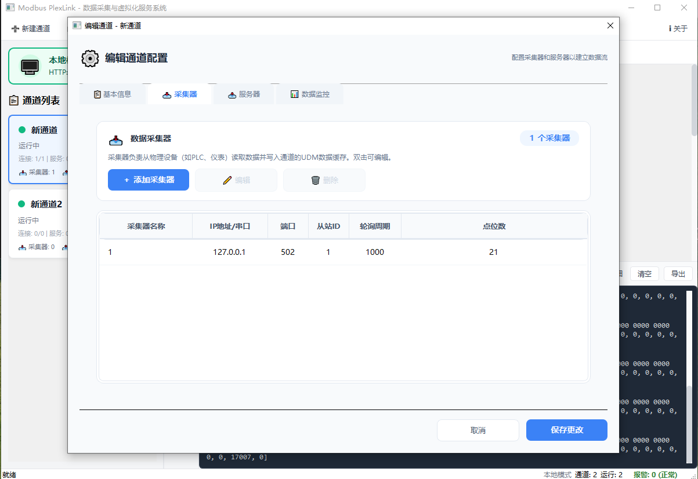

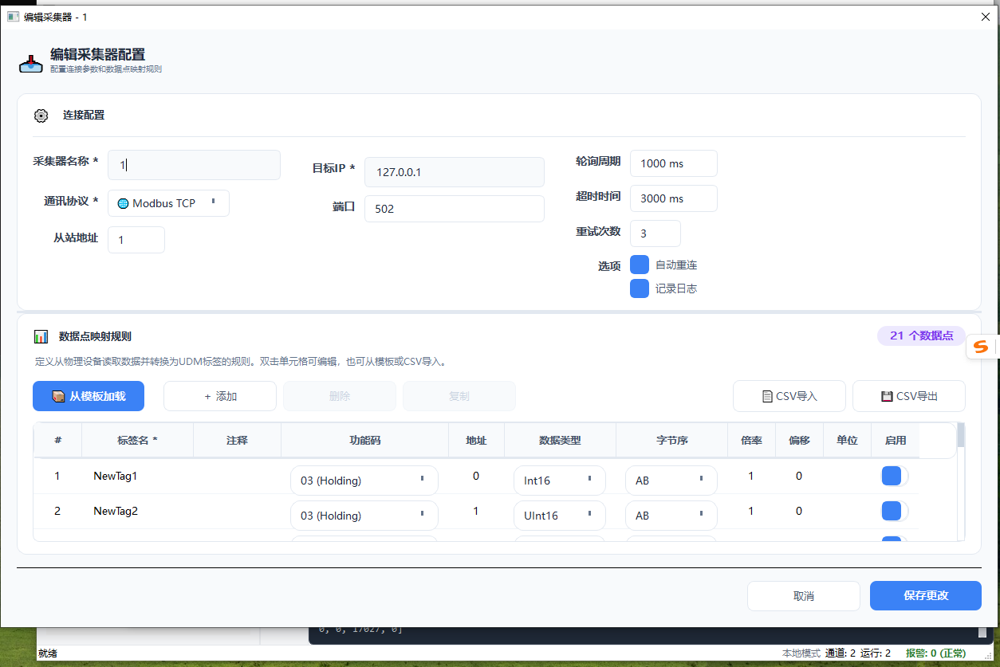

### 2. Modbus虚拟化服务

- **虚拟设备创建**
  - 支持创建多个虚拟从站
  - 灵活的地址映射规则
  - 支持读写分离配置

- **数据转换**
  - 倍率（Scale）和偏移量（Offset）转换
  - 公式表达式支持
  - 单位标注

- **多客户端接入**
  - 支持多个SCADA/HMI客户端同时连接
  - 客户端连接状态监控

#### 配置界面示例

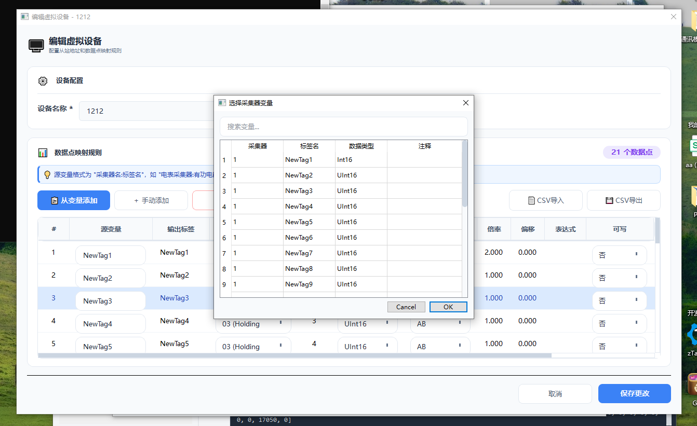

### 3. 通用数据模型（UDM）

- 统一的数据缓存中心
- 标签（Tag）命名体系
- 线程安全的读写操作
- 数据质量标识
- 数据过期检测

### 4. 告警管理

- **告警类型**
  - 高限/高高限告警
  - 低限/低低限告警
  - 数据质量告警
  - 连接丢失告警

- **告警特性**
  - 死区（Deadband）防抖
  - 延时触发
  - 自动确认/手动确认
  - 告警录波联动

#### 界面截图

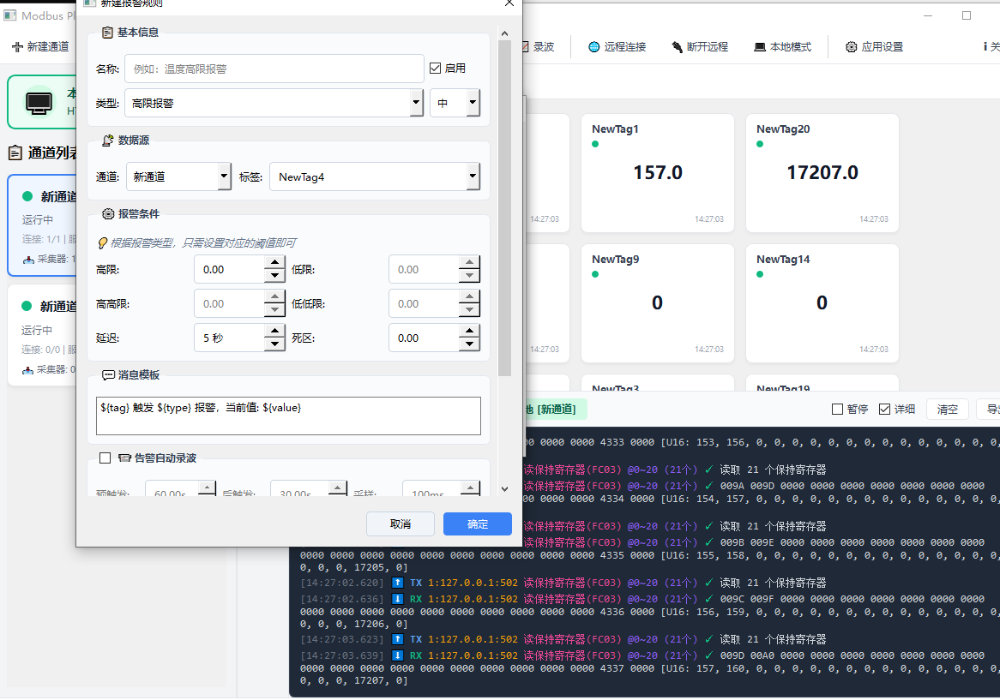

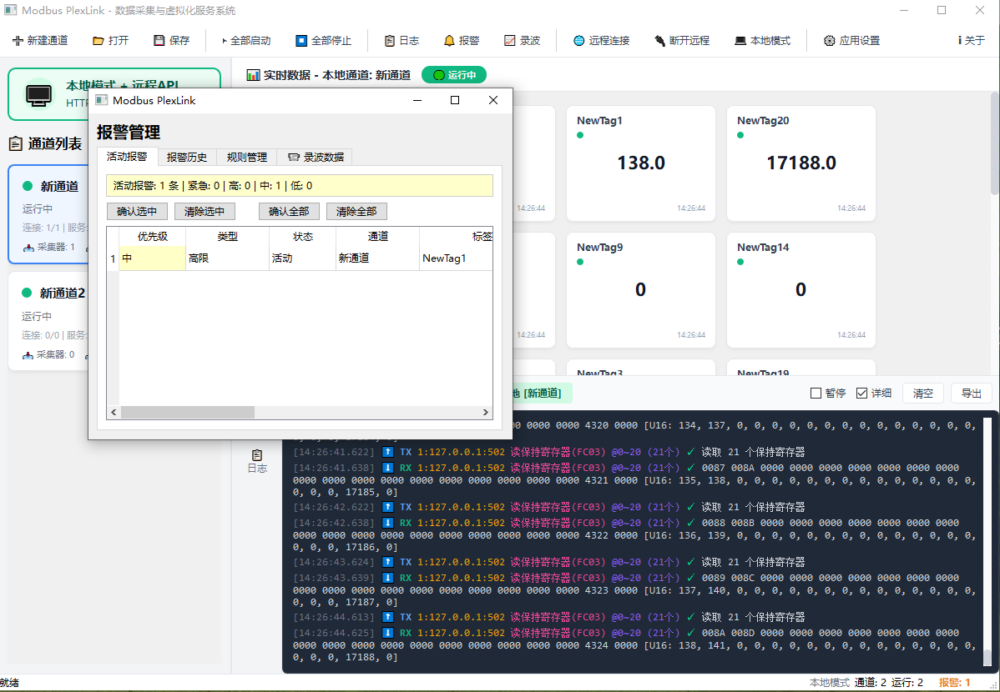

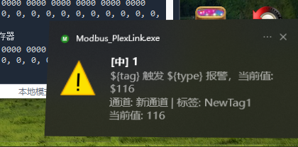

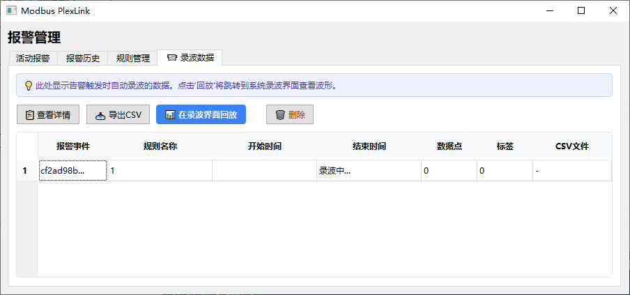

### 5. 波形录波

- **录波功能**
  - 手动录波
  - 条件触发录波
  - 预触发缓存（记录故障前数据）

- **触发条件**
  - 上升沿/下降沿
  - 超限触发
  - 范围触发

- **数据管理**
  - CSV导出
  - 波形图片保存
  - 历史数据回放

#### 界面截图

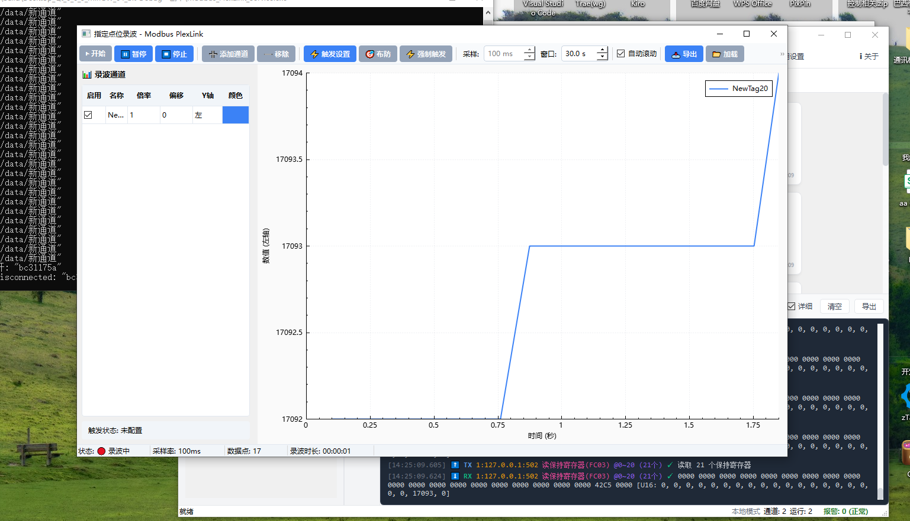

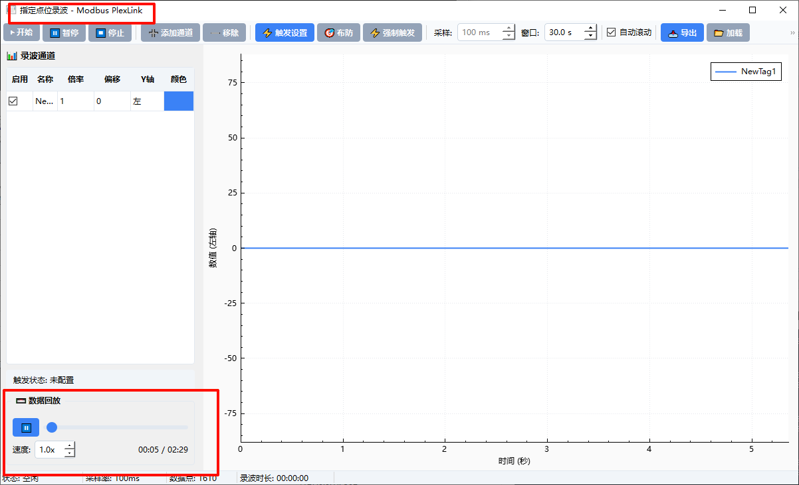

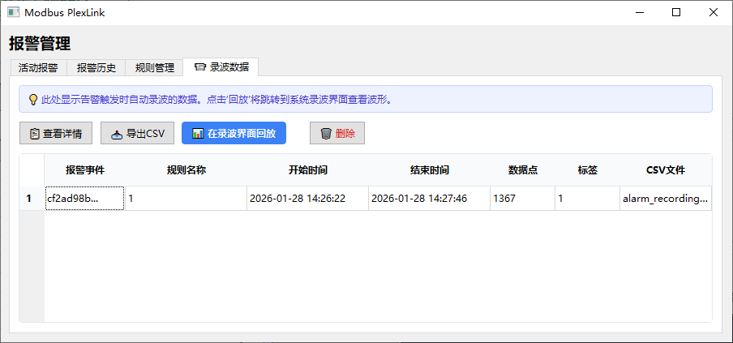

### 6. 远程API与客户端

- **HTTP REST API**
  - 通道管理（CRUD）
  - 采集器/服务器配置
  - 实时数据读写
  - 告警管理
  - 系统配置

- **WebSocket实时推送**
  - 数据订阅
  - 告警通知
  - 状态变更推送
  - 通道状态变化
  - Modbus报文实时推送

- **远程客户端模式**
  - GUI模式支持连接远程网关
  - 远程通道管理（启动/停止/编辑/删除）
  - 远程数据实时监控
  - 远程报文查看
  - 本地和远程模式无缝切换

### 7. GUI界面功能

- **三种运行模式**
  - **本地模式 + API**：本地采集数据，同时提供远程API服务
  - **纯本地模式**：仅本地采集，不启动API服务
  - **远程客户端模式**：连接其他网关进行远程管理

- **数据仪表盘**
  - 卡片式数据展示
  - 实时数据更新
  - 数据质量指示
  - 通道状态显示（在线/离线/等待数据）
  - 支持本地和远程数据源

- **报文查看器**
  - 实时显示Modbus收发报文
  - 本地/远程报文区分显示
  - 报文详细解析（功能码、地址、数据）
  - 通道状态消息显示
  - 报文导出功能

- **通道管理**
  - 卡片式通道列表
  - 通道状态可视化
  - 一键启动/停止/编辑/删除
  - 模式状态指示器（醒目的模式显示）

- **配置界面**
  - 美化的配置对话框
  - 采集器/服务器配置
  - CSV导入导出
  - 设备模板库
  - 应用设置管理（API端口、认证等）

#### 界面截图

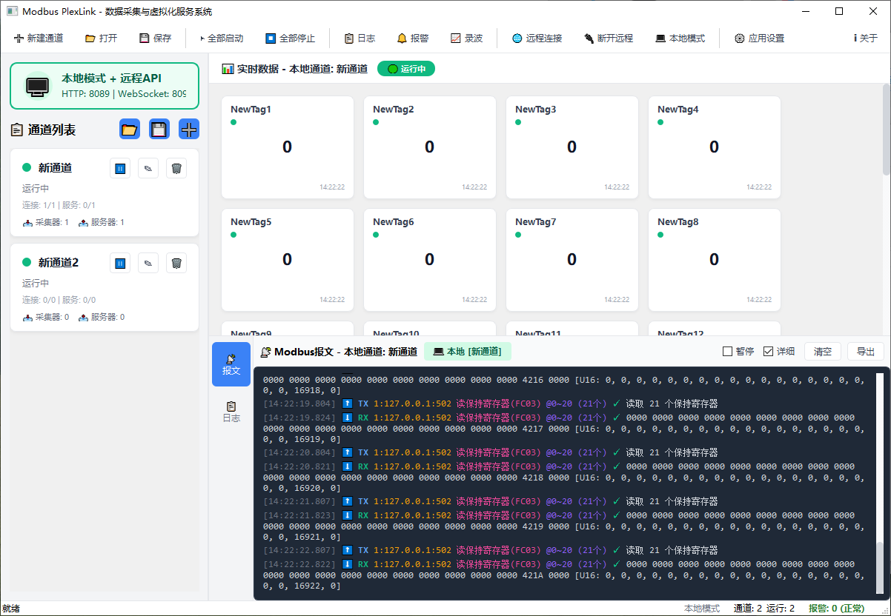

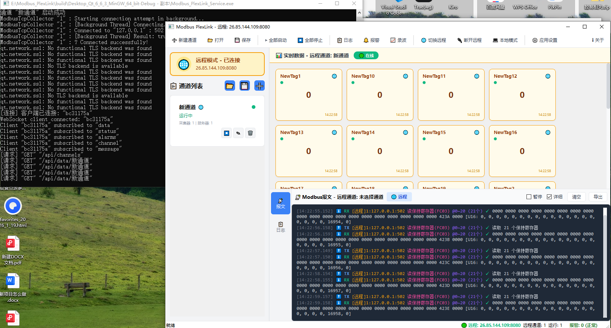

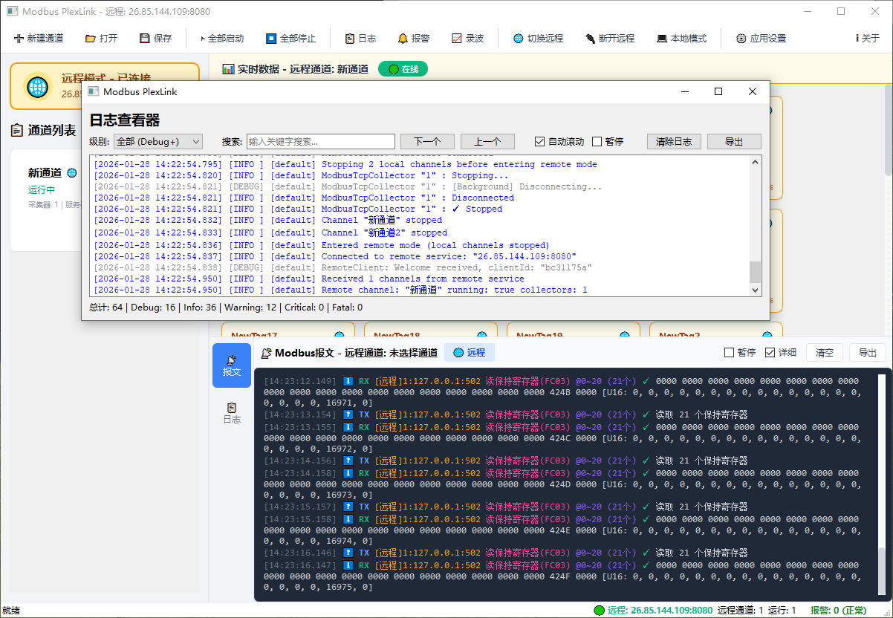

---

## 🏗 系统架构

```
┌─────────────────────────────────────────────────────────────────────┐
│                          Modbus PlexLink                            │
├─────────────────────────────────────────────────────────────────────┤
│                                                                     │
│  ┌─────────────┐    ┌─────────────────────────────────────────┐    │
│  │   远程客户端   │←→ │           RemoteApiServer               │    │
│  │  (Web/App)   │    │    (HTTP REST + WebSocket)              │    │
│  └─────────────┘    └─────────────────────────────────────────┘    │
│                                    ↕                                │
│  ┌─────────────┐    ┌─────────────────────────────────────────┐    │
│  │  SCADA/HMI   │←→ │      ModbusTcpServer (虚拟化服务)        │    │
│  │  上位系统     │    │    ├── VirtualizationEngine            │    │
│  └─────────────┘    │    └── ServerMappingRules               │    │
│                      └─────────────────────────────────────────┘    │
│                                    ↕                                │
│  ┌──────────────────────────────────────────────────────────────┐  │
│  │                   ChannelManager (通道管理器)                  │  │
│  │  ┌───────────┐  ┌───────────┐  ┌───────────┐                │  │
│  │  │ Channel 1 │  │ Channel 2 │  │ Channel N │                │  │
│  │  └─────┬─────┘  └─────┬─────┘  └─────┬─────┘                │  │
│  └────────┼──────────────┼──────────────┼───────────────────────┘  │
│           ↓              ↓              ↓                          │
│  ┌──────────────────────────────────────────────────────────────┐  │
│  │              UniversalDataModel (通用数据模型)                 │  │
│  │                     统一数据缓存与交换                         │  │
│  └──────────────────────────────────────────────────────────────┘  │
│           ↑              ↑              ↑                          │
│  ┌────────┴───┐  ┌───────┴───┐  ┌───────┴───┐                     │
│  │ TCP采集器   │  │ RTU采集器  │  │ TCP采集器  │                     │
│  └─────┬──────┘  └─────┬─────┘  └─────┬─────┘                     │
└────────┼───────────────┼──────────────┼─────────────────────────────┘
         ↓               ↓              ↓
   ┌──────────┐   ┌──────────┐   ┌──────────┐
   │ PLC设备   │   │ 电表设备  │   │ 传感器    │
   │(Modbus)   │   │(Modbus)  │   │(Modbus)  │
   └──────────┘   └──────────┘   └──────────┘
```

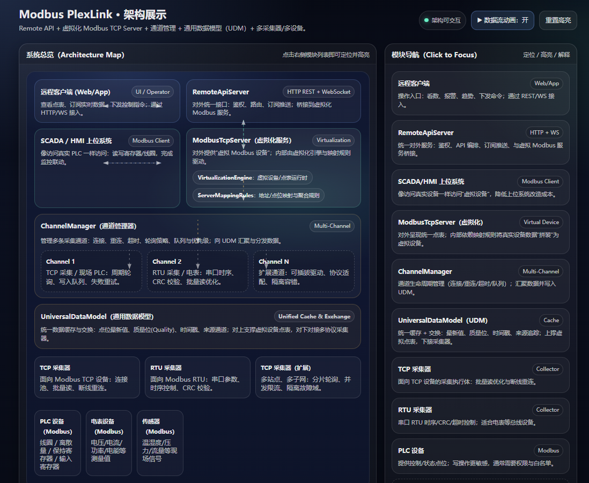

### 核心模块说明

| 模块 | 路径 | 功能描述 |
|------|------|----------|
| **Core** | `src/core/` | 核心数据结构：Channel、ChannelManager、UDM、DataTypes |
| **Adapters** | `src/adapters/` | 协议适配器：ModbusTcp/Rtu采集器、ModbusTcp服务器 |
| **GUI** | `src/gui/` | 图形界面：MainWindow、配置对话框、数据监控、波形录制、远程客户端 |
| **Remote** | `src/remote/` | 远程服务：HTTP REST API、WebSocket服务器/客户端 |
| **Utils** | `src/utils/` | 工具类：告警管理、配置管理、CSV助手、应用设置 |

---

## 🚀 快速开始

### 环境要求

- **操作系统**: Windows 10+ / Linux (Ubuntu 20.04+)
- **编译器**: MinGW-w64 / GCC 9+ (支持C++17)
- **Qt版本**: Qt 6.6+
- **CMake**: 3.16+

### 依赖库

- Qt6 Core, Widgets, Network, Concurrent, WebSockets, PrintSupport
- libmodbus (已包含在ThirdParty目录)
- libcurl (可选，用于HTTP客户端功能)

### 编译步骤

```bash
# 1. 克隆项目
git clone <repository-url>
cd Modbus_PlexLink_daima

# 2. 创建构建目录
mkdir build && cd build

# 3. 配置CMake (使用Qt Creator或命令行)
cmake .. -DCMAKE_PREFIX_PATH=<Qt安装路径>/6.6.3/mingw_64

# 4. 编译
cmake --build . --config Release

# 5. 运行
./Modbus_PlexLink          # GUI模式
./Modbus_PlexLink_Service  # 服务模式
```

### 使用Qt Creator

1. 使用Qt Creator打开 `CMakeLists.txt`
2. 配置Kit为 Qt 6.6 MinGW 64-bit
3. 点击构建运行

---

## 📖 使用指南

### GUI模式

启动 `Modbus_PlexLink.exe` 进入图形界面：

#### 本地模式操作

1. **创建通道**: 点击通道列表右上角 ➕ 按钮或文件 → 新建通道
2. **配置通道**: 编辑通道 → 添加采集器和服务器
3. **配置采集器**: 编辑采集器 → 设置数据点映射（支持CSV导入）
4. **配置服务器**: 编辑服务器 → 设置虚拟设备映射
5. **启动通道**: 点击通道卡片上的"启动"按钮
6. **监控数据**: 右侧仪表盘实时显示数据，报文查看器显示通信报文

#### 远程客户端模式

1. **连接远程**: 点击模式指示器 → 连接远程服务
2. **输入地址**: 输入远程网关的IP和端口（默认8080/8081）
3. **管理远程通道**: 远程通道卡片支持启动/停止/编辑/删除操作
4. **查看远程数据**: 选择远程通道后，右侧仪表盘显示远程实时数据
5. **查看远程报文**: 报文查看器显示远程通道的Modbus通信报文

#### 应用设置

- **API端口配置**: 工具 → 应用设置 → 配置HTTP和WebSocket端口
- **认证设置**: 启用/禁用API认证，设置用户名和密码
- **启动行为**: 配置自动启动通道、最小化到托盘等选项

### 服务模式（无头运行）

```bash
# 基本启动（使用 app_settings.json 中的配置）
./Modbus_PlexLink_Service

# 指定配置文件
./Modbus_PlexLink_Service --config myconfig.json

# 启用认证
./Modbus_PlexLink_Service --auth admin:password

# 自动启动通道
./Modbus_PlexLink_Service --auto-start

# 完整选项
./Modbus_PlexLink_Service \
    --config config.json \
    --http-port 8080 \
    --ws-port 8081 \
    --auth admin:secret \
    --auto-start
```

**注意**: 服务模式优先使用 `app_settings.json` 中的配置，命令行参数会覆盖配置文件中的设置。

### 命令行选项

| 选项 | 简写 | 说明 | 默认值 |
|------|------|------|--------|
| `--config` | `-c` | 配置文件路径 | config.json |
| `--http-port` | `-p` | HTTP API端口 | 8080 |
| `--ws-port` | `-w` | WebSocket端口 | 8081 |
| `--auth` | - | 认证凭据 (user:pass) | 无 |
| `--auto-start` | `-a` | 自动启动通道 | 否 |
| `--alarm-config` | - | 告警配置文件 | alarm_config.json |

---

## 🔌 API文档

### REST API端点

#### 通道管理

| 方法 | 路径 | 描述 |
|------|------|------|
| GET | `/api/channels` | 获取所有通道 |
| GET | `/api/channels/{name}` | 获取指定通道 |
| POST | `/api/channels` | 创建通道 |
| PUT | `/api/channels/{name}` | 更新通道 |
| DELETE | `/api/channels/{name}` | 删除通道 |
| POST | `/api/channels/{name}/start` | 启动通道 |
| POST | `/api/channels/{name}/stop` | 停止通道 |

#### 数据操作

| 方法 | 路径 | 描述 |
|------|------|------|
| GET | `/api/channels/{name}/data` | 获取通道所有数据 |
| GET | `/api/channels/{name}/data/{tag}` | 获取指定数据点 |
| PUT | `/api/channels/{name}/data/{tag}` | 写入数据点 |

#### 告警管理

| 方法 | 路径 | 描述 |
|------|------|------|
| GET | `/api/alarms` | 获取活动告警 |
| POST | `/api/alarms/{id}/acknowledge` | 确认告警 |

#### 系统

| 方法 | 路径 | 描述 |
|------|------|------|
| GET | `/api/system` | 获取系统信息 |
| GET | `/api/statistics` | 获取统计信息 |
| GET | `/api/config` | 获取当前配置 |
| POST | `/api/config/save` | 保存配置 |

### WebSocket API

连接地址: `ws://host:8081`

#### 订阅消息

```json
{
  "type": "subscribe",
  "data": {
    "topics": ["data.Channel1", "alarms"]
  }
}
```

#### 数据推送

```json
{
  "type": "data",
  "channel": "Channel1",
  "data": {
    "Tag1": { "value": 123.45, "quality": "Good", "timestamp": "..." },
    "Tag2": { "value": 67.89, "quality": "Good", "timestamp": "..." }
  }
}
```

#### 通道状态推送

```json
{
  "type": "channel",
  "data": {
    "channel": "Channel1",
    "action": "stateChanged",
    "state": 2,
    "stateString": "Running",
    "running": true
  }
}
```

#### Modbus报文推送

```json
{
  "type": "message",
  "data": {
    "channel": "Channel1",
    "source": "ModbusTCP",
    "direction": "TX",
    "device": "1:192.168.1.100:502",
    "function": "读保持寄存器(FC03)",
    "address": "0~20",
    "data": "0000 0000 ...",
    "success": true,
    "timestamp": "2026-01-15T10:30:00"
  }
}
```

---

## ⚙ 配置说明

### 应用设置 (app_settings.json)

应用级别的配置，适用于GUI和服务模式：

```json
{
  "api": {
    "enabled": true,
    "httpPort": 8080,
    "wsPort": 8081
  },
  "auth": {
    "enabled": false,
    "username": "",
    "password": ""
  },
  "startup": {
    "autoStartChannels": false,
    "minimizeToTray": true
  },
  "files": {
    "channelConfig": "config.json",
    "alarmConfig": "alarm_config.json"
  }
}
```

**配置说明**:
- `api.enabled`: 是否启用API服务器
- `api.httpPort`: HTTP REST API端口（默认8080）
- `api.wsPort`: WebSocket端口（默认8081）
- `auth.enabled`: 是否启用API认证
- `auth.username/password`: API认证凭据
- `startup.autoStartChannels`: 启动时是否自动启动所有通道
- `startup.minimizeToTray`: GUI模式是否最小化到系统托盘
- `files.channelConfig`: 默认通道配置文件路径
- `files.alarmConfig`: 默认告警配置文件路径

### 通道配置文件结构 (config.json)

```json
{
  "version": "1.1.0",
  "channels": [
    {
      "name": "Channel1",
      "enabled": true,
      "description": "主采集通道",
      "collectors": [
        {
          "name": "Collector1",
          "type": "ModbusTCP",
          "host": "192.168.1.100",
          "port": 502,
          "unitId": 1,
          "pollInterval": 1000,
          "timeout": 3000,
          "mappings": [
            {
              "tagName": "Temperature",
              "registerType": "HoldingRegister",
              "address": 0,
              "dataType": "Float32",
              "byteOrder": "CDAB",
              "scale": 0.1,
              "offset": 0,
              "unit": "°C"
            }
          ]
        }
      ],
      "servers": [
        {
          "name": "Server1",
          "type": "ModbusTCP",
          "listenAddress": "0.0.0.0",
          "listenPort": 503,
          "virtualDevices": [
            {
              "virtualUnitId": 1,
              "name": "VirtualDevice1",
              "mappings": [
                {
                  "sourceTagName": "Temperature",
                  "registerType": "HoldingRegister",
                  "address": 100,
                  "dataType": "UInt16",
                  "scale": 10
                }
              ]
            }
          ]
        }
      ]
    }
  ]
}
```

### 数据类型映射

| 数据类型 | 寄存器数 | 说明 |
|----------|----------|------|
| UInt16 | 1 | 无符号16位整数 |
| Int16 | 1 | 有符号16位整数 |
| UInt32 | 2 | 无符号32位整数 |
| Int32 | 2 | 有符号32位整数 |
| Float32 | 2 | 32位浮点数 |
| UInt64 | 4 | 无符号64位整数 |
| Int64 | 4 | 有符号64位整数 |
| Float64 | 4 | 64位浮点数 |
| Bool | 1位 | 布尔值（线圈） |

### 字节序说明

| 字节序 | 说明 | 适用场景 |
|--------|------|----------|
| AB | 大端序（2字节） | 标准Modbus |
| BA | 小端序（2字节） | 部分设备 |
| ABCD | 大端序（4字节） | 标准32位 |
| DCBA | 小端序（4字节） | Intel设备 |
| CDAB | 中端大序（4字节） | 西门子PLC |
| BADC | 中端小序（4字节） | 部分仪表 |

---

## 🎉 V1.1.0 新特性

### 新增功能

- ✨ **GUI远程客户端模式**：GUI应用可以连接远程网关进行管理
- ✨ **本地API服务器**：GUI模式支持启动本地API服务器，可被远程访问
- ✨ **应用设置管理**：统一的配置管理（API端口、认证、启动行为）
- ✨ **数据仪表盘**：卡片式实时数据展示，支持本地和远程数据源
- ✨ **报文查看器**：实时显示Modbus通信报文，区分本地/远程
- ✨ **通道卡片布局**：现代化的卡片式通道列表
- ✨ **模式状态指示器**：醒目的模式显示和快速切换
- ✨ **美化的配置界面**：统一的对话框样式，禁用滚轮误操作
- ✨ **CSV导入优化**：支持多种启用状态格式（true/1/是/启用）
- ✨ **远程通道管理**：完整的远程通道CRUD操作
- ✨ **实时状态推送**：WebSocket推送通道状态变化和Modbus报文

### 优化改进

- ⚡ 本地和远程模式切换时自动停止本地通道
- ⚡ 通道删除后自动清空数据面板
- ⚡ 远程数据自动刷新机制
- 🎨 UI界面美化，提升用户体验
- 🐛 修复模式切换时的资源泄漏问题
- 🐛 修复远程连接代理设置问题

---

## 🔮 后期计划与展望

### 短期计划 (v1.2.0 - Q1 2026)

#### 功能增强

- [ ] **Modbus RTU over TCP**：支持串口服务器透传模式
- [ ] **数据持久化**：本地SQLite数据库存储历史数据
- [ ] **断点续采**：设备重连后自动补采数据
- [ ] **采集器模板**：预置常见设备（电表、PLC）的配置模板

#### 性能优化

- [ ] **采集调度优化**：智能调度多采集器，减少通信冲突
- [ ] **内存池管理**：减少频繁内存分配开销
- [ ] **数据压缩**：WebSocket数据推送支持压缩

#### 用户体验

- [ ] **配置向导**：引导式设备配置流程
- [ ] **在线帮助**：内置帮助文档和工具提示
- [ ] **主题切换**：支持亮色/暗色主题

### 中期计划 (v1.3.0 - Q2 2026)

#### 协议扩展

- [ ] **OPC UA客户端**：支持OPC UA协议设备采集
- [ ] **MQTT发布**：将数据发布到MQTT Broker
- [ ] **HTTP推送**：支持将数据推送到REST API端点
- [ ] **Modbus RTU服务器**：支持作为RTU从站响应

#### 高级功能

- [ ] **脚本引擎**：支持Lua/JavaScript脚本进行数据处理
- [ ] **虚拟点计算**：支持计算型虚拟数据点（求和、平均等）
- [ ] **数据归档**：按时间段归档历史数据
- [ ] **报表导出**：定时生成数据报表（PDF/Excel）

#### 集群部署

- [ ] **主从热备**：支持主从节点自动切换
- [ ] **负载均衡**：多网关负载均衡部署
- [ ] **配置同步**：集群配置自动同步

### 长期展望 (v2.0.0 - 2027)

#### 架构升级

- [ ] **微服务架构**：核心功能模块化，支持独立部署
- [ ] **容器化支持**：提供Docker镜像和Kubernetes部署方案
- [ ] **边缘AI**：集成轻量级机器学习模型进行异常检测

#### 生态建设

- [ ] **插件系统**：支持第三方协议适配器插件
- [ ] **设备库**：社区贡献的设备配置库
- [ ] **Web管理界面**：基于Vue/React的Web配置界面
- [ ] **移动端App**：iOS/Android监控应用

#### 行业解决方案

- [ ] **能源管理**：电力、水务、燃气行业专用版
- [ ] **智能制造**：MES/ERP集成方案
- [ ] **楼宇自控**：BACnet协议支持

### 技术路线图

```
2026 Q1      2026 Q2      2026 Q3      2026 Q4      2027
   │            │            │            │            │
   ▼            ▼            ▼            ▼            ▼
┌─────┐    ┌─────┐    ┌─────┐    ┌─────┐    ┌─────┐
│v1.2 │    │v1.3 │    │v1.4 │    │v1.5 │    │v2.0 │
│     │    │     │    │     │    │     │    │     │
│RTU  │    │OPC  │    │集群 │    │AI   │    │微服 │
│TCP  │    │UA   │    │部署 │    │检测 │    │务   │
│     │    │MQTT │    │     │    │     │    │     │
│数据 │    │     │    │Web  │    │     │    │插件 │
│持久 │    │脚本 │    │界面 │    │     │    │系统 │
└─────┘    └─────┘    └─────┘    └─────┘    └─────┘
```

### 参与贡献

我们欢迎社区贡献！您可以通过以下方式参与：

1. **🐛 提交Issue**：报告Bug或提出功能建议
2. **🔧 Pull Request**：提交代码改进
3. **📝 文档完善**：改进文档和示例
4. **📦 设备适配**：贡献设备配置模板

详细的贡献指南请参阅 [CONTRIBUTING.md](CONTRIBUTING.md)。

---

## 🤝 贡献指南

感谢您对 Modbus PlexLink 的关注！

### 快速开始贡献

```bash
# 1. Fork 本仓库

# 2. 克隆您的 Fork
git clone https://github.com/YOUR_USERNAME/Modbus_PlexLink.git

# 3. 创建功能分支
git checkout -b feature/your-feature

# 4. 提交更改
git commit -m "feat: add your feature"

# 5. 推送并创建 PR
git push origin feature/your-feature
```

### 贡献类型

| 类型 | 说明 |
|------|------|
| 🐛 Bug修复 | 修复已知问题 |
| ✨ 新功能 | 添加新特性 |
| 📝 文档 | 改进文档 |
| 📦 设备模板 | 贡献设备配置 |
| 🌍 翻译 | 多语言支持 |

查看完整指南：[CONTRIBUTING.md](CONTRIBUTING.md)

---

## 📄 许可证

本项目采用 **Apache License 2.0** 开源许可证。

```
Copyright 2024-2026 ModbusPlexLink Contributors

Licensed under the Apache License, Version 2.0 (the "License");
you may not use this file except in compliance with the License.
You may obtain a copy of the License at

    http://www.apache.org/licenses/LICENSE-2.0

Unless required by applicable law or agreed to in writing, software
distributed under the License is distributed on an "AS IS" BASIS,
WITHOUT WARRANTIES OR CONDITIONS OF ANY KIND, either express or implied.
See the License for the specific language governing permissions and
limitations under the License.
```

---

## ⭐ Star 历史

如果这个项目对您有帮助，请给我们一个 Star ⭐

[](https://star-history.com/#user/Modbus_PlexLink&Date)

---

## 📞 联系方式

- **项目主页**: [GitHub Repository](https://github.com/user/Modbus_PlexLink)
- **问题反馈**: [GitHub Issues](https://github.com/user/Modbus_PlexLink/issues)
- **讨论交流**: [GitHub Discussions](https://github.com/user/Modbus_PlexLink/discussions)
- **邮箱**: contact@modbusplexlink.com

---

## 🙏 致谢

感谢以下开源项目：

- [Qt](https://www.qt.io/) - 跨平台 C++ 框架
- [libmodbus](https://libmodbus.org/) - Modbus 协议库
- [QCustomPlot](https://www.qcustomplot.com/) - Qt 绑定库

---

<div align="center">

**Modbus PlexLink** - 连接工业设备，赋能智能制造

Made with ❤️ for Industrial IoT

[⬆ 返回顶部](#modbus-plexlink)

</div>
